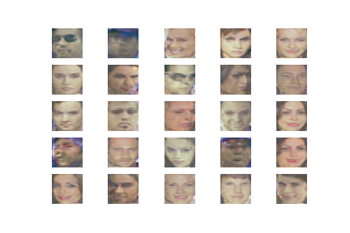

# GestureGAN
### Application of AI in ElectroAcoustic Music

**It should be noted that Google Colab documents run from the Dataset on my Google Drive, a rerouting of the Dataset will be done for public access at some point!

Here is a collection of the code which contributes towards the GAN. 

Firstly, the Dataset is provided from a Kaggle competition. User Daisukelab presents a Preprocessed Mel-Spectrogram representation of audio clips, which are in the form of Numpy arrays.

link: https://www.kaggle.com/daisukelab/fat2019_prep_mels1#trn_noisy_best50s.csv

These arrays are depedent on the length of the audio clips. In our case we want these to all be the same length so I wrote some code to unload the pickle and shorten these arrays to be 1 second long. Program I wrote is provided as a file called ReshapeTheNumpy.ipynb.

Original Numpy format: (128, AUDIO_LENGTH, 3);
New Numpy format: (128, 128, 3);

I originally wanted to use AudioSet, however this dataset only provided csv files of timestamps within YouTube videos. These timestamps represented sounds of a particular condition which was ideal for this interpretation. The FAT2019 Prep-Mels Dataset will have to use a classifier engine to organise these sounds. At the moment I plan to break these down into folder of their particular categories and then train the GAN on each. At this current time I am unsure how this will work with the plan for interpolation between categories, but this will soon be fixed.

AudioSet: https://research.google.com/audioset/

To prove that the numpy arrays can be played back into sound, I tried to adapt Daisukelab's code that he used to generate the dataset. In this program he generates a 2D numpy array, but then transforms this to 3D when converting the STFT representation from Mono to Colour. Potentially this could be benefinicial to the acceptance of the dataset with DCGAN. Because this Generative Adversarial Network is built for RGB images anyway, perhaps it is worth just downgrading the output arrays back to Mono so then they can be processed back into sound.

Yet to be succesful in transferring Mel-Specs back to Audio. Might take advantage of this python program that will allow me the ability to create STFT and inverse it.

Tim Sainburg's implementation of kastnerkyle's work: https://timsainburg.com/python-mel-compression-inversion.html

Because of my inability to convert the MelSpec processed dataset back to sound, I took the raw wav files, reduced their lengths to one second and then processe them through Tim Sainburg's implementation. The audio length code I wrote is called AdjustAudioClip and the implementation of kastnerkyle's code is found in the STFT program.

The resulting Dataset I now have is Numpy arrays of 2 dimensions. Now I must try to implement the Generative Adversarial Network model.

The problem with this is that the arrays are not in a shape that could fit into the image GAN. However the MelSpecs that Daisukelab produced before are perfect for this. I will contact him to ask about the possibility of converting these specs back to sound.

//THE GENERATIVE ADVERSARIAL NETWORK MODEL THAT I HAVE PREVIOUSLY EXPLORED//

The model is built upon a version of DC-GAN outlined by lecturer Jeff Heaton.

DC-GAN with Images: https://github.com/jeffheaton/t81_558_deep_learning/blob/master/t81_558_class_07_2_Keras_gan.ipynb

This application uses images which are represented as 3 dimensional numpy arrays. To tackle this we must adapt this model to accept 1 dimensional arrays that are outputted from our STFT.

<i> These were some numpy arrays creating audio that I generated, here displayed as images. These were all noise.</i>

Currently following a 1D function implementation GAN. Keras model Sequential first layer must take it's input shape. Use Dense function to define this.

How to Develop A 1D Function Generative Adversarial Network: https://machinelearningmastery.com/how-to-develop-a-generative-adversarial-network-for-a-1-dimensional-function-from-scratch-in-keras/

Following on from this, I am trying to develop a short term version of this system to produce waveforms. Replacing the 1D function with a waveform. This work has seen me starting to train a discriminator model. This taking various points from the real waveform and a randomly generated waveform (noise.)

This interpretation of a 1DGAN is currently training on a waveform. Because of the complexity of the waveform, the discriminator model usually trains to a 24% recognition of the real signal and 100-99% recognition of fake. I imagine this wil have a serious effect on the ability to replicate the signal. I am first seeking to try and make sound, then to enhance the models ability of production.

Signals that are produced from the 1DsGAN are completely silent at the moment. But today I will work on this more.

After some testing, the value predicted from the Generator model is corresponding to how large the latent space is through its layers. I believe I have been training the Discriminator model on too little amount of layers. With the complexity of the signal, I am training a model with an increased amount of layers.

Also, I could be improving my performance by choosing 44100 random samples at each level to try and understand the signal better. I currently only train on a 22050 batch as 44100 points are split between 22050 real and fake samples. --> This did not improve things.

However 1DGAN kernel initializers were previously set to he_uniform, which means value were accustomed to a normal distribution around 0(link1). This shouldn't be as such as we are dealing with floating points with a random uniform distribution. Moving back and across over 0 (in terms of audio). Just by changing the layers from he_uniform to random_uniform, the discrimintor model saw a boost in performance registering recognition of real samples by 49% and real by 100-99%.

Currently the 1DGAN works off the function being of symettrical uniform. Random points are selected from the real function and these each connect to form a rough outline of the functions shape. However I propose that we take 'slices' rather than points from a signal. This would mean that 'slices' of continuous audio are fed into the discriminator model, rather than individual points. Because of the complexity of the signal from the audio clip, taking 'slices' should furthermore give the model and understanding of how the points are arranged and positioned throughout the clip.

02/04/20 - DsExGAN is the python program I have interpretted this idea into. I will upload the code soon, currently trying to train the discriminator. DaisukeLab helpfully responded to me today saying that I should check out the Librosa function or potentially research a GAN model that creates plausible sounds based on the Spec image.

03/04/20 - DsExGAN has been trained and tested. The GAN seems to output values that are more realistic. For curiosity I will train a model on much less layers to see its success. I have also multiplied the Output of the GAN files as these are still float values between 0.0-1.0. We will multiply these by 32767 to potentially change the behaviour. I am looking through TensorFlow's own tutorial on custom training. Very similar to 1DGAN lesson, will practice storing audio into Tensors rather than Numpy's. Whilst I am trying to drive the success of getting audio which is like that of the sample, I am also hoping to improve my Discriminators performance by building a more precise model. I am unsure on how the success of multiplying the output will be, however after this I will change the output layer of the Generator Model.

'<i>The ideal number of hidden layers and neurons depends on the problem and the dataset. Like many aspects of machine learning, picking the best shape of the neural network requires a mixture of knowledge and experimentation. As a rule of thumb, increasing the number of hidden layers and neurons typically creates a more powerful model, which requires more data to train effectively.</i>' - Custom Training: Walkthrough (TF)

06/04/20 - Been transforming Numpy arrays to Tensors. Will focus on building a new model today. Training will be overnight. To build this new model, I will be creating a big Numpy array, transferring this to a tensor then transferring this to a tensor dataset. So far today I have created a Dataset from a single audio clip and have built a generator model! Taking influence from the DCGAN model from TensorFlows tutorials, I have thought about returning to generating image from audio. To make this succesful I will need to resize some WavFiles (again, doh!) If I trim my clips to 22500 sample, they will have a tensor shape of (22500, 1), I will then reshape these to a format of (150, 150, 1). This technically being a greyscale image. From the DCGAN[link4] implementation on TensorFlow, I have created a generator which will produce images of this format. My method now is to implement the tutorials architecture, and verify the success of the models. This will be done through plotting the gradient and optimizer performance. For now, I will reshape 1 audio clip to the specified length and save this tensor.

07/04/20 - Deciding to reshape a batch of audio clips. Because of the bigger size of the images, there is much more processing needed in the Convulotion of the images. This produces some errors. I will return to GANSynth to understand the Tensors they produced with their STFT processing algorithms. It's important to note that the images I am trying to create represent the raw waveform. No STFT processing has occured on these audio clips as of yet. However recently I have believed that there is potential to do this without producing an STFT image. We will continue with raw data for now. Scaling of audio clips going into DCGAN and out may need to be scaled better. We must scale the audio around (1,-1) to fit the GANs specification. The output from the network will then be scaled back into its file preferance. Before doing scaling I found these results:

  <i> This was the Image that was used as the Dataset. Here is the sound</i>

  https://soundcloud.com/comeheretohavearave/datasetsound24

<i> Epoch 1 compared to Epoch 50. My stride and processing is at too low of a level for (1, 150, 150, 1). This develops this grid like texture. The Audio for these clips will be added soon.</i>

As mentioned, because of the smaller strides, we recieve a grid like texture which changes in gradient over the epochs. This is evident in my results because I have tried to apply an architecture for smaller resolution images, on a much larger image. I will experiment with the generator and discriminator networks, adjusting the scale of convoluting throughout. Any remarkable results will be posted.

08/04/20 - A lot of today has been about functionally developing the project. Google Drive was running out of space so just moving information to my HD. Because of the behaviour witnessed in yesterdays GAN production, I believe that DCGAN's architecture won't be able to process the necessary amount of information. On research, Progressive GAN architecture could fit our particular needs. Supporting the upscaling of images to the desired output. (This is the architecture of GANSynth.) For the rest of today I will focus on reading through the paper[link5] that establishes the concepts of PGAN and then read through some Machine Learning Mastery posts on the subject. [link6] [link7]

09/04/20 - Building a PGAN today. I think I will reconstruct a dataset appropriate for this model and DCGAN too. I will retry DCGAN with this new dataset and begin to recieve results from PGAN. Each of the 100 resized audio clips will be appended in a Numpy array. These will then be transferred a tensor and reshaped to a 10x10 grid. I'm also investigating representing the signals as 3 dimensional images (RGB).

Dataset is underway now. We are currently forming one with the shape appropriate for smaller PGAN work; tensors with shape (1, 128, 128, 3). First these are trimmed to wav's of 49,152 sample length. Then these will be converted to tensors. Here are some of the images:

<i> These are plotted RGB tensors. I will add the sound for each of these so they can be heard. </i>

Already we can see that the detail is very finite in these images. We will see whether the model can replicate these traits.

It its important to note that PGAN have the potential to create 1024x1024 size images. Whilst this takes considerable power and will most likely involve renting time on a higher spec computer. This could be a possibility. If the PGAN works on a smaller scale with random audio clips, the next steps will be to:

- Develop a classifier and organise the audio clips into folders of their specification.
- Attempt to create a combine a conditional network design (introduce controlled interpolation)
- Create higher resolution, and in-turn, longer audio clips.

10/04/20 - Still following tutorial on the construction of P-GAN's. If I am able to get results from this network. We will then begin inputting audio. Loading in this dataset has taken a huge amount of time. Because of the 20k images being loaded in, this has taken around 5 hours. After finalising the arrangement of the dataset for the google colab. The session no crashes after using too much RAM. I will try this again tomorrow on different settings, but I will then also try and learn how to implement the code on my own system. Perhaps I could run the code and get results locally.

11/04/20 - First run of PGAN code of the day. The session crashed after using too much RAM. However I was offered the ability to connect to a notebook with more RAM, hopefully this should improve my opportunity of results. I have started to recieve results! This is from the practice dataset which is the Large CelebA set[link8]. This means I will then be able to input the plots of sound. The dataset I currently have prepared has a size of 3800 clips. I will add clips from other folders to then have this figure to a possible 20k. I am also considering investigating whether I can increase the visual range of these images by increasing the numpy values by 3x. Hopefully there will be a larger range and more contrast in the plots. I will try this today and post results here.

These are faces generated from the PGAN model from the tutorial[link7]. Tomorrow I will train the audio dataset on this architecture. Before this I will complete a few last tasks today:

- Adjust audio clip length and ensure a larger amount of uncurated samples are available.
- Experiment with representation of clips (3x float values to increase range)
- Ensure clips retain their properties when transferred back to sound
- P-GAN code to include GIF representation of total epoch's. This will be incorporated from a TensorFlow tutorial. [link9]

Because of my inability to be able to succesfully regenerate audio from the STFT images I recieve from Daisukelab's code, I returned to the GANSynth code. From reading their papers before, I understand that they are fully able to perform Audio->Spec-> Audio tasks. Inside their Python program, Specgrams_Helper, they define function's named "waves_to_specgrams" and "specgrams_to_waves". I will look into these methods soon.

Links:

link1 - https://keras.io/initializers/

link2 - https://www.tensorflow.org/tutorials/customization/custom_training

link3 - https://machinelearningmastery.com/how-to-develop-a-generative-adversarial-network-for-a-1-dimensional-function-from-scratch-in-keras/

link4 - https://arxiv.org/pdf/1511.06434.pdf

link5 - https://arxiv.org/pdf/1710.10196.pdf

link6 - https://machinelearningmastery.com/introduction-to-progressive-growing-generative-adversarial-networks/

link7 - https://machinelearningmastery.com/how-to-train-a-progressive-growing-gan-in-keras-for-synthesizing-faces/

link8 - http://mmlab.ie.cuhk.edu.hk/projects/CelebA.html

link9 - https://www.tensorflow.org/tutorials/generative/dcgan

